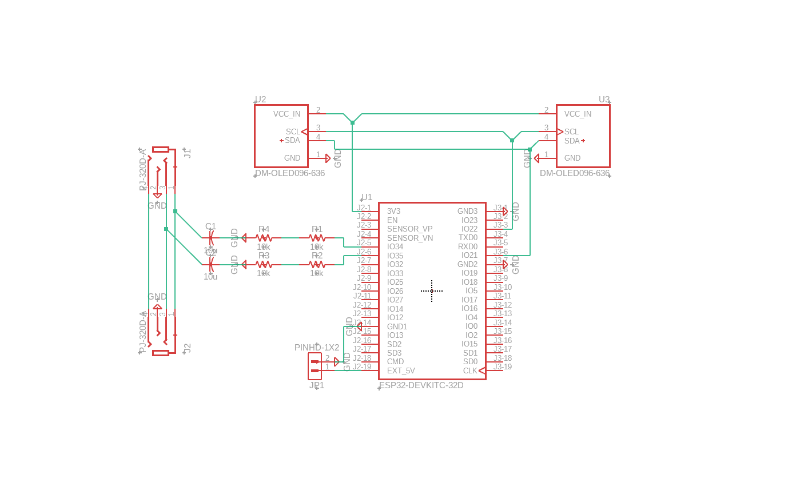

# ESP32-Oscilloscope-Project
This GitHub page contains the code I used for my project of building headphones with an animated screen of the played audio's waveform on each ear.  
More info is available on the page within my personal portfolio, [here](https://walkersimpson1.github.io/Oscilloscope-Project.html)

